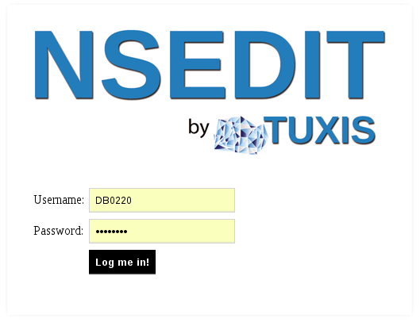
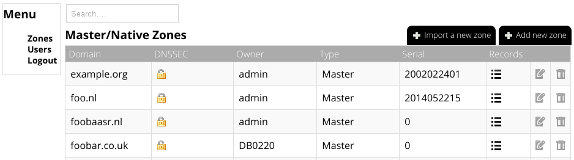
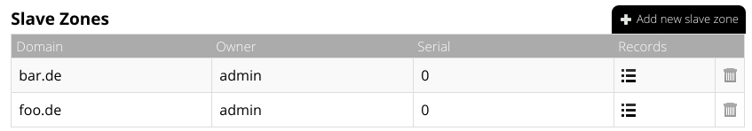

What is nsedit?
===============

nsedit is a DNS editor for [PowerDNS](https://www.powerdns.com/). It is created
to finally replace poweradmin and take DNS editing to what we're used at in
2014. It uses the PowerDNS API to make changes in your zones, so you can use
the backend that you want, no matter what.

Features
========
* Import BIND- or AXFR-style dumps of your existing zones
* Add/remove zones and records
* Clone zones
* Show the DNSsec details of a zone
* Multiple user support
* Allow logging of all actions in NSEdit, including exporting the log in JSON-format
* [experimental] nsedit API, to create zones from another system

User support
============
Multiple users are supported. A user can be an admin or a normal user. You can
configure whether or not a normal user is allowed to add new zones.

WeFact Login support
====================
[WeFact](https://www.wefact.com/wefact-hosting/) is _A hosting billing
product_. nsedit can authenticate against the WeFact API, which allows your
customers to login on nsedit with their WeFact credentials. It will
automatically show their domains and allow them to edit them.

Requirements
============
* A webserver running php
* php sqlite3
* php curl
* php with openssl support
* PowerDNS with the JSON-api enabled. Version 4.0.0 or greater

Installing
==========

* Via Git
    -  Run git clone in the directory where you want to run nsedit from
    : ```git clone https://github.com/tuxis-ie/nsedit.git```

    - Select tag v1.0 or skip this if you want to run from master
    : ```git checkout tags/v1.0```
* Via releases
    - Download the zip-file from [Releases](https://github.com/tuxis-ie/nsedit/releases)

* Copy ```includes/config.inc.php-dist``` to ```includes/config.inc.php``` and edit config.inc.php to your needs.

* By default, nsedit writes its user database to ../etc/pdns.users.sqlite3. Be sure that your webserver can create that directory and write to it.

* Visit http(s)://<url>/nsedit/ and login with admin/admin (Don't forget to update your password!)

Have fun ;)

Other methods of installation (Unsupported)
===========================================

* Baji Zsolt created a Suse image: https://susestudio.com/a/vvnMqa/powerdns-with-nsedit
* Yury Evtikhov created the Docker file: https://github.com/tuxis-ie/nsedit/blob/master/Dockerfile

Configuring PowerDNS
====================
Minimal configuration of PowerDNS for supporting nsedit has to include 3 directives:
```
webserver=yes
api=yes
api-key=SomeRandomString
```

Special note for Ubuntu Xenial Xerus 16.04 users:
Default `pdns` package included in Ubuntu repositories has the version of 4.0.0-alpha2 and *nsedit v1.0* doesn't work with it due to API incompatibility.

If your PowerDNS version is not the latest one, please consider adding PowerDNS repository to your system.

Detailed instructions for adding repository are available at http://repo.powerdns.com/


Screenshots
===========






